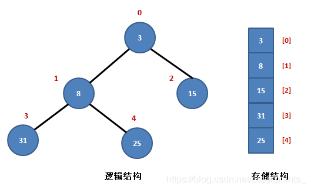

## 执行 K 次操作后的最大分数

给你一个下标从 0 开始的整数数组 nums 和一个整数 k，你的起始分数为 0。

在一步操作中：

1. 选出一个满足 `0 <= i < nums.length` 的下标 `i`，
2. 将你的分数增加 `nums[i]`。
3. 将 `num[i]` 替换为 `ceil(nums[i] / 3)`。

返回在恰好执行 `k` 次操作后，你可能获得的最大分数。

> 向上取整函数 `ceil(val)` 返回一个大于等于`val`的最小整数。

---

### 方法一：暴力求解

代码如下：通过遍历找到数组的最大值，然后执行相关的操作。

```c
long long maxKelements(int* nums, int numsSize, int k) {
    // 初始分数
    long long score = 0;

    for (int i = 0; i < k; ++i) {
        // 记录 nums 中值最大的位置和最大值
        int index = 0, max = 0;
        for (int j = 0; j < numsSize; ++j) {
            if (nums[j] > max) {
                index = j;
                max = nums[j];
            }
        }

        score += max;
        nums[index] = ceil(max / 3.0);
    }
    return score;
}
```

这种方法在 LeetCode 中因为超过时间限制而不通过。它的时间复杂度为$O(nk)$，空间复杂度为$O(1)$。

---

### 方法二：贪心+优先队列

在一次操作中，我们会将`nums[i]`变成`ceil(nums[i] / 3)`，并增加`nums[i]`的得分。由于：
- 数组中其他元素不会变化；
- 对于两个不同的元素`nums[i]`和`nums[j]`，如果`nums[i] <= nums[j]`，那么对它们都进行一次操作后，`nums[i] <= nums[j]`仍然成立；

这就说明，我们每一次操作都应当贪心地选出当前最大的那个元素。

因此，我们可以使用一个大根堆（优先队列）来维护数组中所有的元素。在每一次操作中，我们取出堆顶元素 `x`，将答案增加 `x`，再将$[\dfrac{x}{3}]$放回优先队列中即可。这种方法的时间复杂度为$O(n\log n)$，空间复杂度为$O(n)$。一些特定的语言可以原地初始化堆，这时空间复杂度为$O(1)$。

#### 堆排序详解---大顶堆

堆是一颗顺序存储的**完全二叉树**。

每个节点的关键字都不大于其孩子节点的关键字，这样的堆称为**小根堆**；每个节点的关键字都不小于其孩子节点的关键字，这样的堆称为**大根堆**。

下图展示的就是一个典型的小根堆以及它的存储结构



堆排序的基本思想是：将待排序序列构造成一个大顶堆，此时，整个序列的最大值就是堆顶的根节点。所以堆排序的重点就在于构造出这样的大顶堆。

首先，按照堆定义将数组`R[0] ~ R[n]`调整为堆（这个过程称为创建初始堆），交换`R[0]`和`R[n]`。

接着将`R[0] ~ R[n-1]`调整为堆，交换`R[0]`和`R[n-1]`。如此反复，直到交换`R[0]`和`R[1]`为止。具体的过程大致如下：

下图为对数组`[1, 3, 4, 5, 2, 6, 9, 7, 8, 0]`的堆排序算法：


##### 疑问：为什么`size / 2 - 1`是最后一个非叶子节点

在二叉堆（Binary Heap）中，每个节点的值都大于等于（或小于等于）其子节点的值。因此，对于一个非叶子节点，它的左右子节点的索引分别为 2 * i + 1 和 2 * i + 2。最后一个非叶子节点的索引可以通过计算得到：

```c
int last_non_leaf_index = size / 2 - 1;
```

---
#### 链接列表

- [README.md](../../README.md)
- [Source Code](./daily.c)