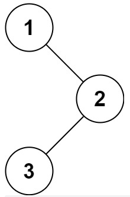

## 二叉树的先序遍历

#### 描述

给你二叉树的根节点`root`，返回它节点值的前序遍历。

数据范围：二叉树的节点数量满足`1 <= n <= 100`，二叉树节点的值满足`1 <= val <= 100`，树的各节点的值各不相同。

#### 示例



```txt
输入：{1, #, 2, 3}的二叉树
输出：[1, 2, 3]
```

---
#### 链接列表

- [README.md](../../README.md)
- [Source Code](./daily.c)