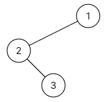

## 二叉树的中序遍历

#### 描述

给定一个二叉树的根节点`root`，返回它的中序遍历结果。

数据范围：树上的节点满足$0 \leqslant n \leqslant 1000$，树上每一个节点的值都满足$-1000 \leqslant val \leqslant 1000$。

示例：


```txt
输入：{1, 2, #, #, 3}
返回值： [2, 3, 1]
```
