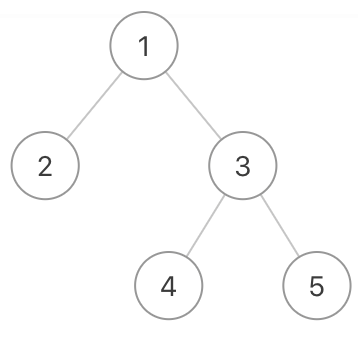

## 按“之”字形顺序遍历二叉树

#### 描述

给定一个二叉树，返回该二叉树的“之”字形层序遍历（第一层从左向右，下一层从右向左，一直这样交替）

数据范围：`0 <= n <= 1500`，树上每个节点的`val`满足`|val| <= 1500`。

#### 举例

给定的二叉树是`{1, 2, 3, #, #, 4, 5}`，该二叉树的“之”字形层序遍历结果是：

\[
\[1],
\[3, 2],
\[4, 5]
]



```
输入：{1, 2, 3, #, #, 4, 5}
返回值：[[1], [3, 2], [4, 5]]
```

---
#### 链接列表

- [README.md](../../README.md)
- [Source Code](./daily.c)