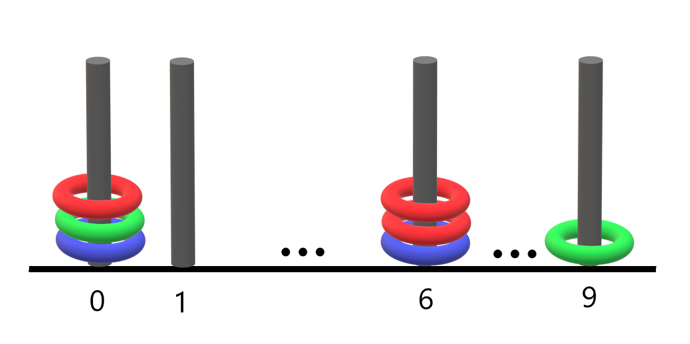

## 环合杆

#### 描述

总计有`n`个环，环可以是红、绿、蓝中的一种。这些环分别穿在10根编号为`0`到`9`的杆上。

给你一个长度为`2n`的字符串`rings`，表示这`n`个环在杆上的分布。`rings`中每两个字符形成一个颜色位置对，用于描述每一个环：

- 第`i`对中的第一个字符表示第`i`个环的颜色(`R`、`G`、`B`)。
- 第`i`对中的第二个字符表示第`i`个环的位置，也就是在哪根杆上（`0`到`9`）。

例如，`R3G2B1`表示共有3个环，红色的环在编号为3的杆上，绿色的环在编号为2的杆上，蓝色的环在编号为1的杆上。找出所有集齐全部颜色环的杆，并散会这种杆的数量。

#### 示例



```txt
输入：rings = "B0B6G0R6R0R6G9"
输出：1
解释：
- 编号 0 的杆上有 3 个环，集齐全部颜色：红、绿、蓝。
- 编号 6 的杆上有 3 个环，但只有红、蓝两种颜色。
- 编号 9 的杆上只有 1 个绿色环。
因此，集齐全部三种颜色环的杆的数目为 1 。
```

#### 官方题解

对于每一个杆，我们只在意它上面有哪些颜色的环，而不在意具体的数量。因此我们可以用一个大小为`10 * 3`的数组分别表示是否有红、绿、蓝颜色的环，值为1则表示有，值为0则表示没有。

每次遇到一个环，就修改对应杆相应的颜色状态为1。最后遍历所有的杆，统计三个颜色状态都为1的杆的个数，并返回。

---
#### 链接列表

- [README.md](../../README.md)
- [Source Code](./daily.c)