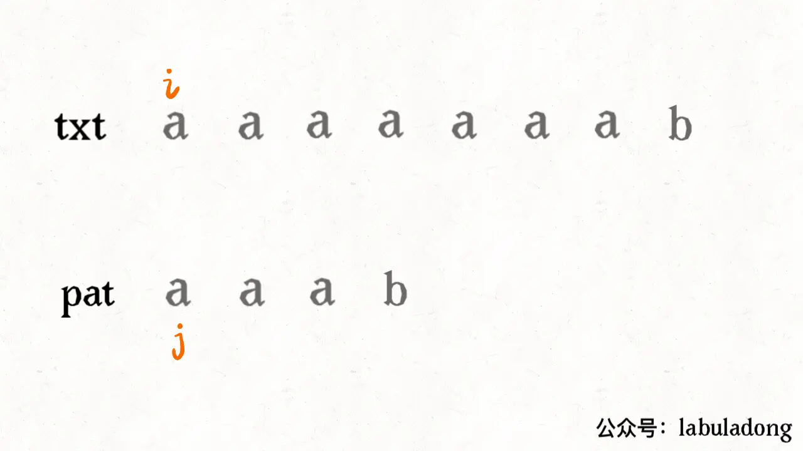
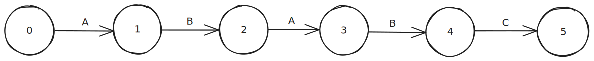

## 基因配对

#### 描述

已知n个人的供体基因库和一个人的受体基因，请利用朴素的字符串匹配算法或KMP算法等实现基因匹配。第一行代表供体基因库的基因串数量n，`n >= 1`，之后的n行代表基因库中的每个基因串。最后一行代表匹配结果。匹配结果的第一个整数表示和第几个基因串实现了最佳匹配。第二个整数表示匹配的点位，第三个数表示匹配度。匹配点位是指受体基因和基因库中某个基因串最高相似的第一次最高相似的起始位置p；匹配度是指受体基因和基因库中某个基因串的最高相似度，公式为`从p开始连续的基因数/受体基因串的长度 * 100%`。

相似度要求保留小数点后2位，如果匹配失败，则输出结果为：`0 0 0.00%`。

#### 示例

```text
输入：
3
TGAAGGTGATTAG
TTAAGGTATATTTATATT
GATTGGTTAGATATTG
TATAGA

输出：
2 7 66.67%
```

#### KMP算法
参考教程：[KMP算法详解](https://zhuanlan.zhihu.com/p/83334559)

KMP算法的过程大概如下：



KMP算法是一个高效的子字符串识别算法，它的核心在于根据要匹配的子字符串动态规划匹配的状态。



如上图所示，设要匹配的字符串为`"ABABC"`。那么我们可以把匹配的状态分为0~5五个状态。其中状态0为未开始匹配，状态5为匹配完成。首先，KMP的原则是，被匹配的字符串是不会回退的，回退只会在要匹配的子字符串中进行，也就是子串中状态的流转。

子字符串流转的状态并不取决于主字符串的值，它只与子字符串有关。例如，因为子字符串的第一个字符是A，当状态为0时，如果下一个匹配的字符为A，那么状态流转到1，否则状态保持0。所以，KMP的难点就是根据子串构造它的动态规划数组。如果得到动态规划数组，我们就可以知道一个状态在匹配到哪个字符可以进行状态前进，在哪种情况下是状态回退。

从上面的动图中可以看出，在第一次匹配失败之后，子字符串并没有从头开始分配，而是从`aaa`继续分配，这是通过影子状态来实现的。影子状态是指和当前状态具有相同前缀的状态。例如，在子串`ABABC`中，状态2就是状态4的影子状态。如果在状态4中匹配到主字符串中的字符为A，那么它就需要从状态4回退。与普通的回退不同的是，KMP算法选择的是回退到它的影子状态，并在影子状态重新判断状态流转。**由于影子状态的前缀和当前状态的前缀是相同的，所以从当前状态回退到影子状态并不会导致影子状态之前的字符串匹配出现错误，即使我们没有再去验证它。

这里我们设这个动态规划数组为`dp`数组，设主字符串为`str`，设子字符串为`pat`。设置影子状态为`X`，当前的状态则为`status`。

我们确定状态流转的过程，就是根据所匹配的字符判断它状态流转情况的过程。首先可以确定的是，在每一个状态中，只有一个字符可以进行状态的前进，其他的过程都会造成状态的回退。回退不一定回退到字符串的开头，准确的来说是回退到该状态的影子状态。而很多节点的影子状态可以默认为状态0，虽然状态0并不符合影子状态的定义，但是如果一个节点没有影子状态，它就会回退到状态0，所以这里就可以设置默认的影子状态为0）。

所以，对于一个节点，它的影子状态默认为0，当匹配的字符为`pat[status]`时状态前进，其他的都回退到影子状态，再在影子状态重新匹配，直到状态前进或回退到状态0。所以剩下的难点就是非0的影子状态的获取。

拿`ABABC`的例子来说，状态1和状态2的影子状态为0，状态3的影子状态为1，是因为状态2匹配到`pat[status] = B`时进行状态前进，而状态2的影子状态匹配到`pat[status] = B`时也会进行状态前进，简单来说，这个状态的前进和它的影子状态的前进匹配的是同一个字符。（你会发现，如果将影子状态设置为默认0，当影子状态开始前进的时候，从状态0开始到影子状态结束的前缀和从当前状态往前数相同的状态数的前缀是相同的，即从3到2，从1到0的字符串是相同的）。

这样就可以确定一个状态的影子节点：`X = dp[X][pat[status]]`。这个公式的目的是，对X也进行状态流转，如果它匹配到`pat[status]`可以进行状态前进的话，那`status`的影子状态就是`X + 1`，这其实也是`dp[X][pat[status]]`。如果它匹配到`pat[status`不可以进行前进的话，那就说明当前匹配的前缀已经不同了，只能回退到该影子节点的影子节点，即更短的前缀字符串了。

所以KMP算法确定动态规划最核心的三个动作就是：
1. 确认该状态进行状态前进匹配的字符。
2. 确认该状态进行状态回退匹配的字符。
3. 确认该状态的影子状态。

首先确认要匹配的字符串的长度，因为动态规划数组是描述每一个状态对每一个字符的流转的选择的，所以设子字符串的长度为`Length`，那么动态规划数组的大小应该为`Length * 256`（256为 ASCII字符的个数）。这里需要注意，其实只声明一个`1 * 256`的数组也可以解决问题，只是在流转到某个状态的时候需要重新对动态规划数组重新赋值。

先将该数组的影子状态的流转赋值给当前状态的流转，即：

```c
for (int c = 0; c < 256; ++c)
    dp[status][c] = dp[X][c];
```

这样，当前状态的状态前进和状态回退都和它的影子状态相同，然后再重新设置当前状态的状态前进字符：

```c
dp[status][pat[status]] = status + 1;
```

这是，当前状态既有当前状态正确的状态前进匹配字符，又有正确的影子状态的流转字符，当它状态前进时，直接状态加一；当它状态回退时也可以保证它回退到影子状态并判断影子状态的状态流转字符。

最后是影子状态的更新，这个就是上面给出的表达式：

```c
X = dp[X][pat[status]]
```
下面是完整代码：

```c
#include <stdio.h>
#include <stdlib.h>

int main() {
    // 为主字符串和子字符串赋值
    char *str = (char *) malloc(sizeof(char) * 1000);
    char *pat = (char *) malloc(sizeof(char) * 1000);
    scanf("%s", str);
    scanf("%s", pat);
    
    // 影子状态
    int X = 0;
    // 状态的个数
    int Length = (int)strlen(pat) + 1;
    
    // 初始化动态规划数组
    int ** dp = (int **) malloc(sizeof(int *) * Length);
    for (int i = 0; i < Length; ++i) {
        dp[i] = (int *) malloc(sizeof(int) * 256);
        for (int j = 0; j < 256; ++j) {
            dp[i][j] = 0;
        }
    }
    
    // 设置动态规划数组
    for (int status = 0; status < Length; ++status) {
        // 回退到影子状态
        for (int c = 0; c < 256; ++c) {
            dp[status][c] = dp[X][c];
        }
        // 状态前进
        dp[status][pat[status]] = status + 1;
        // 更新影子状态
        X = dp[X][pat[status]];
    }
    
    // 开始匹配
    int status = 0;
    for (char * move = str; *move != '\0'; ++move) {
        status = dp[status][*move];
        if (status == Length - 1)
            // 匹配成功
            return 0;
    }
    // 匹配失败
    return -1;
}
```

---
#### 链接列表

- [README.md](../../README.md)
- [Source Code](./daily.c)