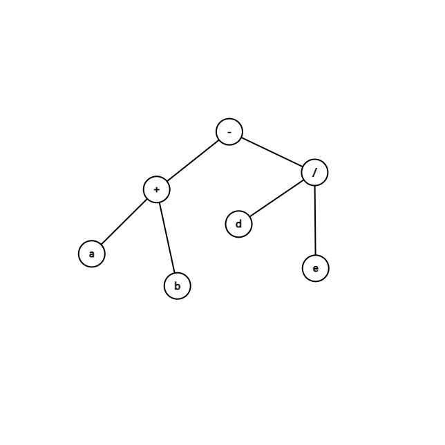

## 二叉树的建立与遍历

#### 描述

设二叉树的节点的数据域的类型为`char`，请完成：

1. 根据带空的先缀串建立一颗二叉树
2. 输出先序、中序、后序遍历的结果
3. 输出叶子节点的数量
4. 输出二叉树的深度
5. 输出非递归中序遍历的结果

#### 举例

例如，对于以下二叉树



```text
输入：-+a##b##/d##e##
输出：
-+ab/de
a+b-d/e
ab+de/-
4
3
a+b-d/e
```


---
#### 链接列表

- [README.md](../../README.md)
- [Source Code](./daily.c)