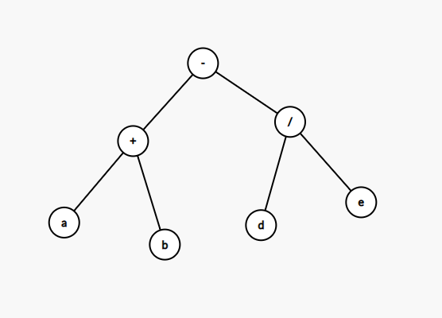

## 根据先缀表达式建立二叉树与遍历

#### 描述

设二叉树的结点的数据域的类型为`char`，请完成：

1. 根据先缀表达式建立一颗二叉树。
2. 输出先序、中序和后序遍历的结果。

根据题意，对于逻辑结构如下的一颗二叉树而言：



其输入用例为：
```text
-+ab/de
```

其输出用例为：
```text
-+ab/de
a+b-d/e
ab+de/-
```

用例说明：

1. 输入用例为先缀表达式串，由字母、+、-、*、/构成。
2. 输出用例的三行结果分别代表先序、中序和后序遍历的结果。

---
#### 链接列表

- [README.md](../../README.md)
- [Source Code](./daily.c)
