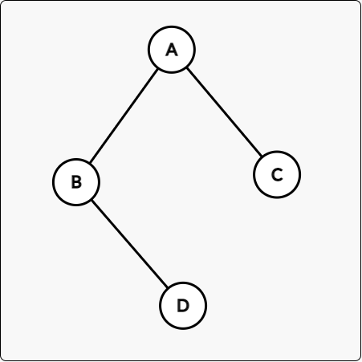

## 线索二叉树的构建与遍历

#### 描述

设二叉树的节点的数据类型为`char`，请完成：

1. 根据带空的先缀串建立一颗二叉树T。
2. 构建T中的中序线索二叉树Thrt。
3. 基于Thrt实现T的中序遍历，并输出遍历结果。
4. 输出Thrt中一度顶点的数量。

输入用例中的`#`表示空节点，输出用例的第一行代表中序遍历的结果，输出用例的第二行表示线索二叉树上一度顶点的数量。

#### 举例

根据题意，杜宇逻辑结构如下的一颗二叉树而言：



其输入用例为：

```text
AB#C##D##
```

其输出用例为：

```text
BCAD
2
```

---
#### 链接列表

- [README.md](../../README.md)
- [Source Code](./daily.c)