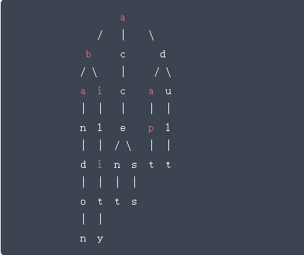

#树的建立与遍历

#### 描述

设树的节点为`char`类型，请用左孩子右兄弟表示法建树，并完成遍历操作。

1. 以二元组`(fa, ch)`的形式自上而下，自左而右依次输入数的各边，建立树的孩子-兄弟链表，`fa`表示`ch` 的父亲，`ch`是`fa`的孩子。
2. 输出树的先序遍历结果。
3. 输出树的中序遍历结果。
4. 输出树的后序遍历结果。
5. 输出树的深度。
6. 输出树中叶子节点的数量。
7. 输出树中从根到叶子的路径。

#### 示例

针对如下所示的树：



相应的输入用例为：

```text
#,a
a,b
a,c
a,d
b,a
b,i
c,c
d,a
d,u
a,n
i,l
c,e
a,p
u,l
n,d
l,i
e,n
e,s
p,t
l,t
d,o
i,t
n,t
s,s
o,n
t,y
#,#
```

说明：有序对的第一元为`#`时，则以第二元为树根；第二元为`#`时，则表示录入结束。本题中第一行`#`，`A`中的第一元为`#`，则表示第二元`A`为树根，最后一行`#`，`#`中第二元为`#`，则表示录入结束。

相应的输出用例为：

```text
abandonilityccentssdaptult
nodnaytilibtnssecctpatluda
abcdaicaunlepldinsttottsny
7
6
abandon
ability
accent
access
adapt
adult
```

说明：第一行为先序遍历结果，第二行为后序遍历结果，第三行为层次遍历的结果，第四行为树的深度，第五行为树中叶子结点的数量,第六行一直到最后一行依次输出从根到叶子的路径。

---
#### 链接列表

- [README.md](../../README.md)
- [Source Code](./daily.c)